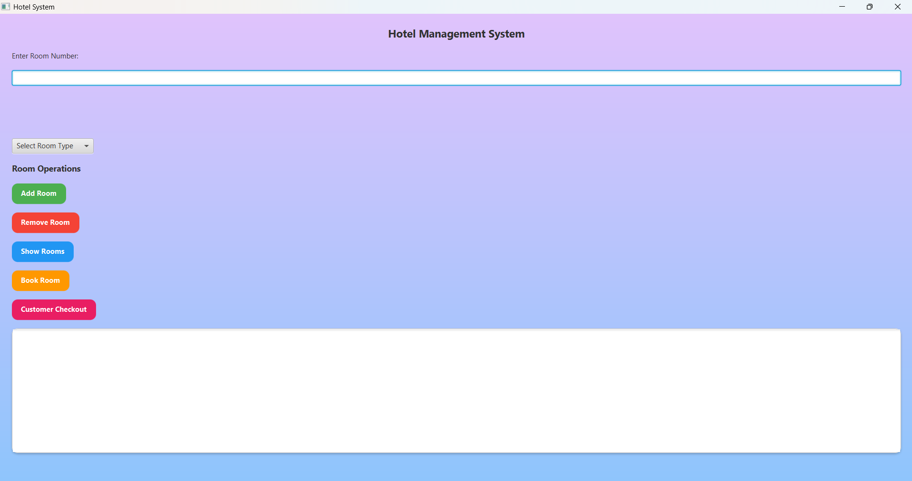
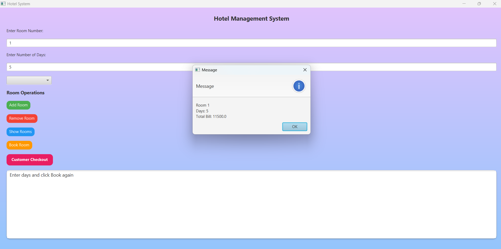
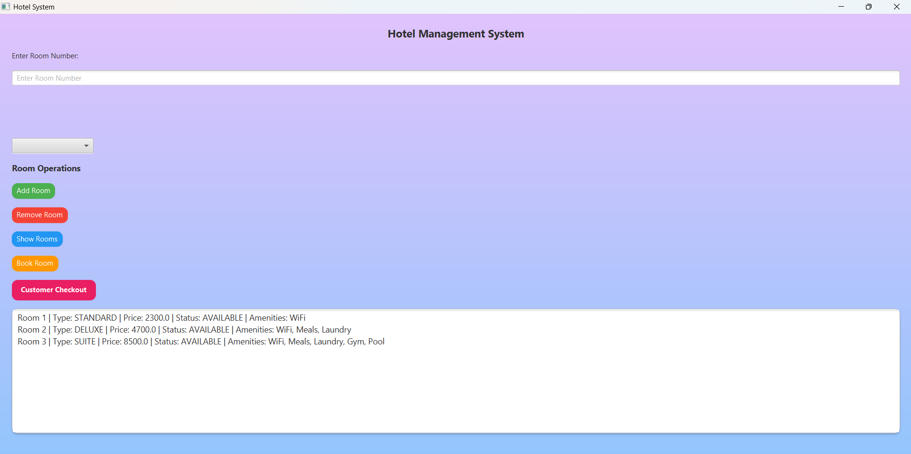

# 🏨 Hotel Management System

A Hotel Management System developed using **Java, JavaFX, Maven, Object-Oriented Programming (OOP), and File Handling**.

## ✨ Features

- Add new rooms
- Remove existing rooms
- Display all available rooms
- Book rooms for customers
- Customer checkout
- Persistent data storage using file handling
- Interactive JavaFX graphical user interface

## 🛠️ Technologies Used

- Java
- JavaFX
- Maven
- Object-Oriented Programming (OOP)
- File Handling

## 📂 Project Structure

```
HotelManagement_Maven
│── src/main/java
│── pom.xml
│── rooms.txt
│── .gitignore
```

## 🚀 How to Run

1. Clone the repository:

```bash
git clone https://github.com/Dhruv973/Hotel-Management-System.git
```

2. Open the project in VS Code or IntelliJ IDEA.

3. Make sure Maven dependencies are downloaded.

4. Run `Main.java` to launch the JavaFX application.

## 📸 Screenshots

### 🏠 Home Screen



---

### 🛏️ Room Booking



---

### 📋 Show Rooms



---

⭐ If you found this project interesting, feel free to star the repository.
