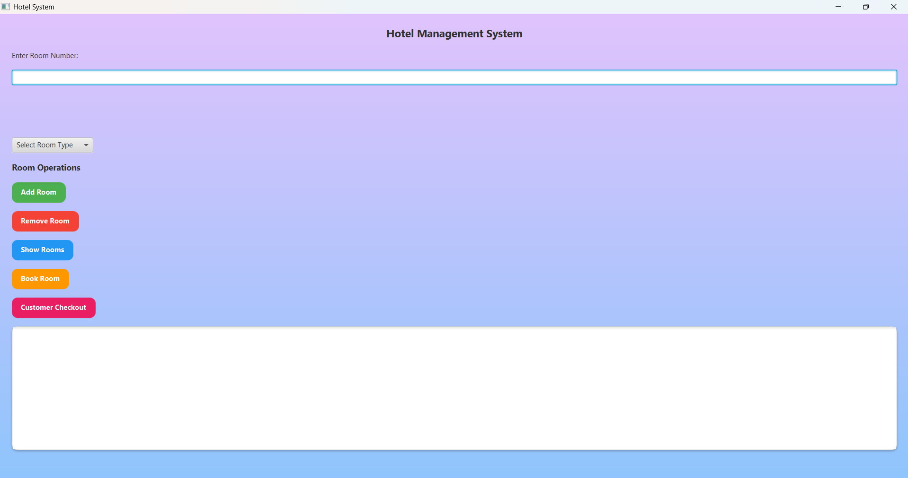
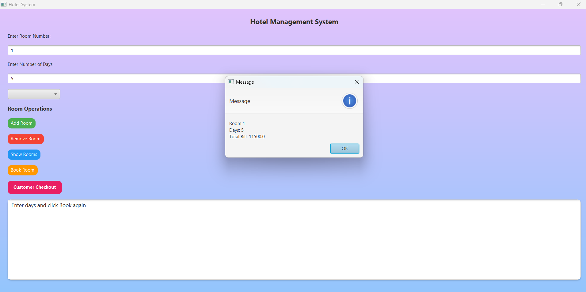
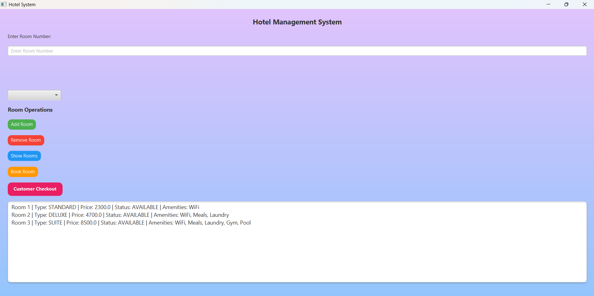

# 🏨 Hotel Management System

A Hotel Management System developed using **Java, JavaFX, Maven, Object-Oriented Programming (OOP), and File Handling**.

## ✨ Features

- Add new rooms
- Remove existing rooms
- Display all available rooms
- Book rooms for customers
- Customer checkout
- Persistent data storage using file handling
- Interactive JavaFX graphical user interface

## 🛠️ Technologies Used

- Java
- JavaFX
- Maven
- Object-Oriented Programming (OOP)
- File Handling

## 📂 Project Structure

```
HotelManagement_Maven
│── src/main/java
│── pom.xml
│── rooms.txt
│── .gitignore
```

## 🚀 How to Run

1. Clone the repository:

```bash
git clone https://github.com/Dhruv973/Hotel-Management-System.git
```

2. Open the project in VS Code or IntelliJ IDEA.

3. Make sure Maven dependencies are downloaded.

4. Run the JavaFX application using Maven:
  
   mvn clean javafx:run

## 🧠 OOP Concepts Demonstrated

- **Abstraction:** `Room` is an abstract class that defines common properties and behavior for different room types.
- **Encapsulation:** Room data is kept private and accessed through public methods such as getters and setters.
- **Inheritance:** `StandardRoom`, `DeluxeRoom`, and `SuiteRoom` extend the `Room` class.
- **Polymorphism:** Each room type provides its own implementation of the `calculateTariff()` method.
- **Interface:** The `Amenities` interface defines common service methods implemented by applicable room types.
- **Enum:** `RoomType` represents room categories and their base prices.
- **ArrayList:** `HotelManager` uses an `ArrayList` to manage room objects.
- **File Handling:** Room information is saved to and loaded from `rooms.txt`.
- **JavaFX Event Handling:** User actions such as adding, removing, booking, and checkout are handled through JavaFX events.
- **Multithreading:** `BookingThread` extends `Thread` and is used to handle the booking process.

## 📸 Screenshots

### 🏠 Home Screen



---

### 🛏️ Room Booking



---

### 📋 Show Rooms



---

⭐ If you found this project interesting, feel free to star the repository.
